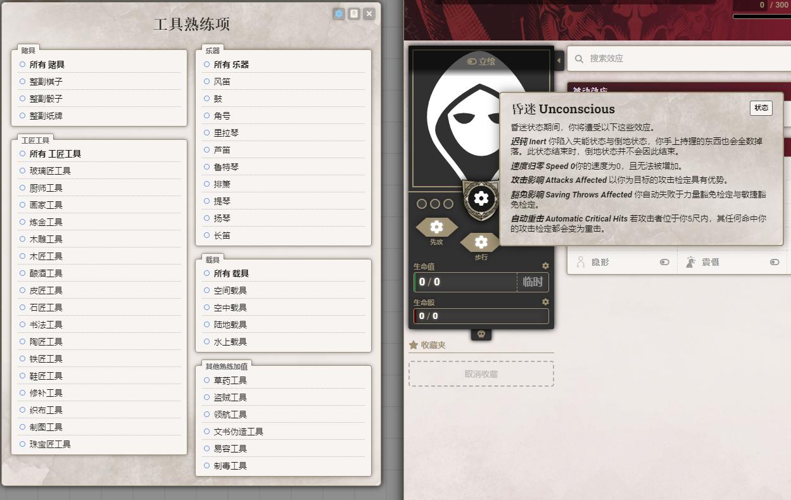

# dnd-simplified-chinese-babele-patch

Another translation using Babele.
使用方法：  
打开安装MOD界面，复制以下路径

    https://raw.githubusercontent.com/feederze/dnd-simplified-chinese-babele-patch/main/dnd-simplified-chinese-babele-patch/module.json

汉化其他方式较难触及的地方

- 工具/乐器 熟练项
- 有系统级依赖的文本 (例如状态说明)

并得益于babele,无惧版本更新。

### 已知问题

在无2024phb的情况下，技能说明未汉化（系统限制暂时没辙）

### ~~TODO~~ DONE

workflow从汉化平台拉取最新内容并打包

自动压缩并发布更新

### 特别感谢

Paratranz站 及 站主 [Bruce](https://github.com/bruceCzK)
