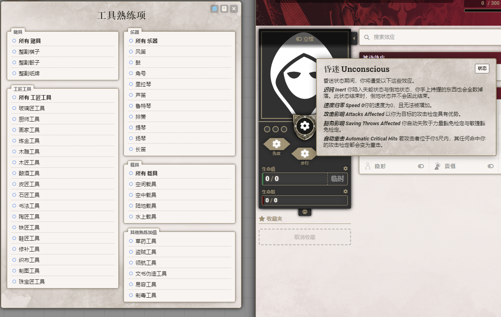

# DnD 5e Simplified-Chinese Babele Patch · DND5E 简体中文 Babele 补丁

[](https://foundryvtt.com)
[](https://github.com/foundryvtt/dnd5e)
[](https://github.com/Federkun/babele)
[](https://www.typescriptlang.org/)

A Foundry VTT module that layers **Simplified-Chinese** translations onto the
D&D 5e system through [Babele](https://github.com/Federkun/babele). It focuses on
the parts of the system other translation layers struggle to reach — tool/instrument
proficiencies, condition descriptions, item effects, advancements, and activities —
and thanks to Babele it survives system version updates.

> **Language / 语言:** [English](#english) · [简体中文](#简体中文)




---

## English

### Overview

This module is a *translation patch*: it does not replace the D&D 5e system, it
supplements other Chinese localizations by translating fields that are normally
hard to reach (system-level/dependent text). Translation content is sourced from
the community [Paratranz project](https://paratranz.cn/projects/13245/leaderboard)
and applied at runtime via Babele converters, so no Compendium data is permanently
modified.

### Features

| Area | What it translates |
| --- | --- |
| **Tool / instrument proficiencies** | Proficiency labels other layers miss |
| **System-dependent text** | e.g. status/condition descriptions |
| **Item effects** | Active-effect names & descriptions |
| **Advancements** | Titles & hints (with identifier fallback) |
| **Activities** | Names, descriptions, hints, conditions, special target/range text |
| **Item names & descriptions** | Optionally rendered **bilingually** (`译名 Original`) |

### Requirements

- Foundry VTT **v12–v13**
- The **D&D 5e** system
- The **[Babele](https://github.com/Federkun/babele)** module (a hard dependency)

### Installation

In Foundry's *Add-on Modules → Install Module* dialog, paste one of these manifest URLs:

- **Latest release (recommended, auto-updates):**

  ```
  https://github.com/feederze/dnd-simplified-chinese-babele-patch/releases/download/latest/module.json
  ```

- **Track `main` directly:**

  ```
  https://raw.githubusercontent.com/feederze/dnd-simplified-chinese-babele-patch/main/dnd-simplified-chinese-babele-patch/module.json
  ```

Then enable both **Babele** and this module in your world.

### Settings

| Setting | Default | Effect |
| --- | --- | --- |
| **激活DND babele汉化** (`autoRegisterBabel`) | on | Auto-register the translation with Babele on startup. |
| **名称双语转换器开关** (`namesetting`) | on | When on, names render bilingually as `译名 Original`; when off, only the translation is shown. |
| **Babele 屏蔽列表子菜单** | — | GM-only menu to exclude specific Compendium packs from translation. |

#### Blacklist menu

The GM-only **blacklist menu** lists every translated Compendium pack, grouped by
namespace. Ticking a pack (or a whole group) excludes it from translation. Choices
persist in the hidden `PackStatus` world setting and are reconciled with the
available packs each time Babele loads.

### How it works

Babele applies *converters* to Compendium fields according to a mapping document
(`rules/mapping.json`). This module registers six converters:

- `effects`, `advancement`, `activities` — merge translated fields into nested
  structures.
- `itemsConverter` — translates embedded item names/descriptions (bilingual-aware).
- `dynamicname` / `advancementitemsConverter` — bilingual name rendering.

All converter *logic* is pure and dependency-injected (see Architecture), so the
behaviour is unit-tested without a running Foundry instance.

### Known limitations

- Without the 2024 PHB content, skill descriptions are not translated (a system
  limitation, not something this patch can currently work around).

### Development

This repo is written in **TypeScript**, bundled with **Rollup**, tested with
**Vitest**, and typed against
[`@league-of-foundry-developers/foundry-vtt-types`](https://www.npmjs.com/package/@league-of-foundry-developers/foundry-vtt-types).

```bash
npm install        # install dependencies
npm run typecheck  # tsc --noEmit
npm run lint       # eslint
npm test           # vitest run
npm run build      # rollup -> built JS (git-ignored)
```

`npm run build` emits two git-ignored artifacts:

- `dnd-simplified-chinese-babele-patch/scripts/init.js` — the browser module that
  `module.json` loads.
- `tools/generate-light-index.mjs` — the Node CLI used by the release workflow.

#### Architecture

Decision logic is separated from the Foundry runtime so it can be tested directly:

```
src/
├── module/
│   ├── constants.ts          # module id + setting keys
│   ├── pack-status.ts        # pure blacklist helpers (tested)
│   ├── converters.ts         # createConverters(deps) -> 6 converters (pure via DI, tested)
│   ├── settings.ts           # registerSettings()            ┐
│   ├── babele-registration.ts# Babele wiring + dataLoaded     ├ Foundry "shell"
│   ├── blacklist-menu.ts     # FormApplication               │ (build + typecheck validated)
│   └── init.ts               # Hooks entry point             ┘
└── tools/
    └── generate-light-index.ts  # pure helpers + main() shell (helpers tested)
types/                         # foundry-vtt-types (lenient) + Babele/dnd5e/settings decls
tests/                         # Vitest unit tests
```

Babele calls converters with a fixed signature, so their Foundry dependencies
(`foundry.utils.mergeObject` and the bilingual setting) are injected via
`createConverters(deps)`. Tests inject a faithful `mergeObject`, exercising real
merge behaviour rather than a mock.

#### Index-generator CLI

`tools/generate-light-index.mjs` walks a directory of Babele translation files and
emits lightweight `labels.json` / `titles.json` indexes used to translate Compendium
list labels and index titles cheaply at startup.

```bash
node tools/generate-light-index.mjs --input <translation-dir> [options]

  --labels-output <file>   labels.json output path (default: <input>/labels.json)
  --titles-output <file>   titles.json output path (default: <input>/titles.json)
  -o, --output <file>      alias for --labels-output
  --include-folders        also index pack folder names
  --deep                   index nested `name` fields, not just top-level entries
  --no-recursive           do not descend into subdirectories
  --compact                minified JSON output
  --dry-run                print to stdout instead of writing files
  -h, --help               show usage
```

#### Release workflow

`.github/workflows/CreateRelease.yml` runs on a schedule (and on demand). It
installs dependencies, type-checks, tests, and builds, then downloads the latest
translation artifact from Paratranz, trims mapping fields, regenerates the indexes,
bumps the version, zips the module, and publishes the `latest` release.
`.github/workflows/ci.yml` runs type-check, lint, test, and build on every push and PR.

### Credits

- The translators of the [Paratranz project](https://paratranz.cn/projects/13245/leaderboard)
  and its maintainer [Bruce](https://github.com/bruceCzK).
- Module authors: 诸位汉化者, Dora.

Translation content belongs to the upstream Paratranz project and its contributors.

---

## 简体中文

### 简介

本模块是一个 **汉化补丁**：它不替换 D&D 5e 系统，而是作为其它中文本地化的补充，
翻译那些通常难以触及的字段（系统级 / 依赖系统的文本）。翻译内容来自社区
[Paratranz 项目](https://paratranz.cn/projects/13245/leaderboard)，在运行时通过
Babele 转换器应用，**不会**永久修改任何 Compendium 数据。

### 功能

| 范围 | 翻译内容 |
| --- | --- |
| **工具 / 乐器熟练项** | 其它汉化层遗漏的熟练项标签 |
| **依赖系统的文本** | 例如状态说明 |
| **物品效果（Effects）** | 主动效果的名称与说明 |
| **进阶（Advancement）** | 标题与提示（带 identifier 回退） |
| **活动（Activities）** | 名称、说明、提示、条件、特殊目标 / 射程文本 |
| **物品名称与说明** | 可选 **双语** 显示（`译名 原名`） |

### 依赖要求

- Foundry VTT **v12–v13**
- **D&D 5e** 系统
- **[Babele](https://github.com/Federkun/babele)** 模块（强依赖）

### 安装

在 Foundry 的 *附加模块 → 安装模块* 界面中，粘贴下列任一清单（manifest）链接：

- **最新发布版（推荐，可自动更新）：**

  ```
  https://github.com/feederze/dnd-simplified-chinese-babele-patch/releases/download/latest/module.json
  ```

- **直接跟随 `main` 分支：**

  ```
  https://raw.githubusercontent.com/feederze/dnd-simplified-chinese-babele-patch/main/dnd-simplified-chinese-babele-patch/module.json
  ```

随后在你的世界中同时启用 **Babele** 与本模块。

### 设置项

| 设置 | 默认 | 作用 |
| --- | --- | --- |
| **激活DND babele汉化** (`autoRegisterBabel`) | 开 | 启动时自动向 Babele 注册汉化。 |
| **名称双语转换器开关** (`namesetting`) | 开 | 开启时名称以 `译名 原名` 的双语形式显示；关闭时只显示译名。 |
| **Babele 屏蔽列表子菜单** | — | 仅 GM 可见，用于将特定 Compendium 集合排除出翻译。 |

#### 屏蔽列表菜单

仅 GM 可见的 **屏蔽列表菜单** 会按命名空间分组列出所有被翻译的 Compendium 集合。
勾选某个集合（或整组）即可将其排除出翻译。选择会保存在隐藏的 `PackStatus` 世界设置中，
并在每次 Babele 加载时与当前可用的集合进行核对。

### 工作原理

Babele 会依据映射文件（`rules/mapping.json`）对 Compendium 字段应用 *转换器*。
本模块注册了六个转换器：

- `effects`、`advancement`、`activities` —— 将译文合并进嵌套结构。
- `itemsConverter` —— 翻译内嵌物品的名称 / 说明（支持双语）。
- `dynamicname` / `advancementitemsConverter` —— 双语名称渲染。

所有转换器 *逻辑* 都是纯函数并通过依赖注入实现（见“架构”），因此无需运行 Foundry
即可进行单元测试。

### 已知限制

- 在没有 2024 版 PHB 内容的情况下，技能说明无法被翻译（这是系统限制，本补丁暂时无法绕过）。

### 开发

本仓库使用 **TypeScript** 编写，通过 **Rollup** 打包、**Vitest** 测试，并基于
[`@league-of-foundry-developers/foundry-vtt-types`](https://www.npmjs.com/package/@league-of-foundry-developers/foundry-vtt-types)
进行类型标注。

```bash
npm install        # 安装依赖
npm run typecheck  # tsc --noEmit
npm run lint       # eslint
npm test           # vitest run
npm run build      # rollup -> 生成 JS（已被 git 忽略）
```

`npm run build` 会生成两个被 git 忽略的产物：

- `dnd-simplified-chinese-babele-patch/scripts/init.js` —— 由 `module.json` 加载的浏览器端模块。
- `tools/generate-light-index.mjs` —— 发布流程使用的 Node 命令行工具。

#### 架构

决策逻辑与 Foundry 运行时分离，以便直接测试：

```
src/
├── module/
│   ├── constants.ts          # 模块 id 与设置键
│   ├── pack-status.ts        # 纯粹的屏蔽列表辅助函数（已测试）
│   ├── converters.ts         # createConverters(deps) -> 6 个转换器（依赖注入的纯函数，已测试）
│   ├── settings.ts           # registerSettings()            ┐
│   ├── babele-registration.ts# Babele 注册 + dataLoaded       ├ Foundry “外壳”
│   ├── blacklist-menu.ts     # FormApplication 表单           │（由构建 + 类型检查保障）
│   └── init.ts               # Hooks 入口                     ┘
└── tools/
    └── generate-light-index.ts  # 纯辅助函数 + main() 外壳（辅助函数已测试）
types/                         # foundry-vtt-types（lenient）+ Babele/dnd5e/设置声明
tests/                         # Vitest 单元测试
```

Babele 以固定签名调用转换器，因此它们所需的 Foundry 依赖（`foundry.utils.mergeObject`
和双语设置）通过 `createConverters(deps)` 注入。测试会注入一个忠实的 `mergeObject`，
从而验证真实的合并行为而非 mock。

#### 索引生成命令行工具

`tools/generate-light-index.mjs` 会遍历某个 Babele 翻译文件目录，生成轻量的
`labels.json` / `titles.json` 索引，用于在启动时低成本地翻译 Compendium 列表标签与索引标题。

```bash
node tools/generate-light-index.mjs --input <翻译目录> [选项]

  --labels-output <文件>   labels.json 输出路径（默认：<输入目录>/labels.json）
  --titles-output <文件>   titles.json 输出路径（默认：<输入目录>/titles.json）
  -o, --output <文件>      --labels-output 的别名
  --include-folders        同时索引集合的文件夹名
  --deep                   索引嵌套的 `name` 字段，而不仅是顶层条目
  --no-recursive           不递归进入子目录
  --compact                输出压缩后的 JSON
  --dry-run                打印到标准输出而非写入文件
  -h, --help               显示用法
```

#### 发布流程

`.github/workflows/CreateRelease.yml` 会定时（以及手动）运行：安装依赖、类型检查、
测试并构建，随后从 Paratranz 下载最新翻译产物、修剪 mapping 字段、重新生成索引、
递增版本号、压缩模块并发布 `latest` 版本。`.github/workflows/ci.yml` 会在每次
push 与 PR 时运行类型检查、lint、测试与构建。

### 致谢

- [Paratranz 项目](https://paratranz.cn/projects/13245/leaderboard) 的诸位汉化者
  及站主 [Bruce](https://github.com/bruceCzK)。
- 模块作者：诸位汉化者、Dora。

翻译内容归上游 Paratranz 项目及其贡献者所有。
